# Rock Paper Scissors by World's Web
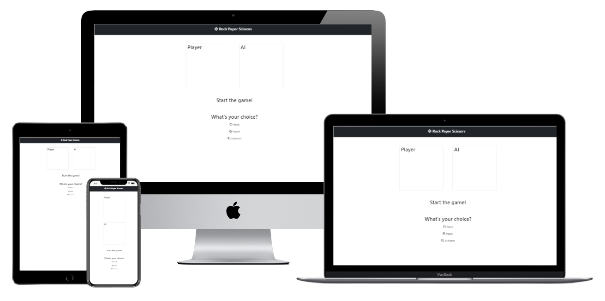

## Disclaimer

The stories, people, brands and products in this software development project are fictitious and any resemblance to real life occurrence is by pure coincidence. The developer of this project, as part of an academic portfolio, referred to and used various open source materials available online to create an interactive brochure website, all of which are credited at the end.

## Project Overview

This is a front-end web development project to present a web application equivalent of the classic game Rock Paper Scissors.

World's Web is an extra curricular group that wants to inspire students to take interest in software development. Rock Paper Scissors as a game was chosen for its strong familiarity among target user populations and simplicity of development. This shifts the focus of discussion towards the relevance and benefit of basic software development in the lives of young people. It will be presented during group activities and made available online for all to access.

### Group Goals

* Create the web application as an introductory device to the software development
* The site must be interactive with easy controls
* Accessible online at any time on any device

### Target Audience

* New or acquainted with using websites
* Applicable to all demographics, with a particular focus on younger students in an academic environment
* Minimalist aesthetic

## User Experience and Design

### User Stories
As a user of this web application game, I want to...

* Be able to use the controls easily
* Replay the activity for endless use
* Keep track of my score
* See feedback of my actions

### Wireframes

[Figma](https://www.figma.com/) was chosen for the wireframing environment as it offers powerful features for free.

Simplified wireframes were created for rapid development of the simple application.

Mobile Device

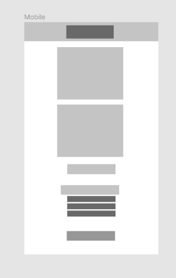

Tablet Device

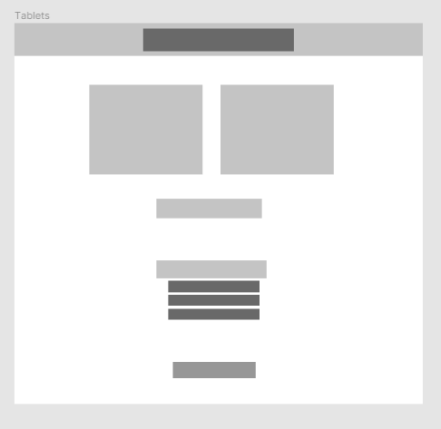

Desktop Device

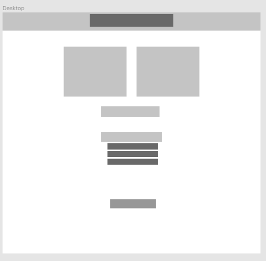

### Device Dimensions

* [The Bootstrap 5 Framework](https://getbootstrap.com/docs/5.0/layout/containers/) uses predetermined device dimensions:
  * Extra small <576px
  * Small ≥576px
  * Medium ≥768px
  * Large ≥992px
  * X-Large ≥1200px
  * XX-Large ≥1400px
* This allows for a responsive and personalised website experience.

### Typography
* [The Bootstrap 5 Framework](https://getbootstrap.com/docs/5.0/content/reboot/#native-font-stack) uses a predetermined set of native fonts,
* Allowing for maximum compatibility while maintaining aesthetic coherence:
```
$font-family-sans-serif:
  // Cross-platform generic font family (default user interface font)
  system-ui,
  // Safari for macOS and iOS (San Francisco)
  -apple-system,
  // Windows
  "Segoe UI",
  // Android
  Roboto,
  // Basic web fallback
  "Helvetica Neue", Arial,
  // Linux
  "Noto Sans",
  "Liberation Sans",
  // Sans serif fallback
  sans-serif,
  // Emoji fonts
  "Apple Color Emoji", "Segoe UI Emoji", "Segoe UI Symbol", "Noto Color Emoji" !default;
```

### Color Pallette

For simplicity and consistency, two main colors were chosen using boostrap default colors:
* Primary: #212529 >>> 'bootstrap dark'
* Secondary: #f8f9fa >>> 'boostrap light'


### Logo

* The logo was chosen for its simplicity.
* The logo is taken directly from [Font Awesome 5](https://fontawesome.com/)
* This particular icon is called [Fantasy Flight Games](https://fontawesome.com/icons/fantasy-flight-games)
* It may be trademarked according to Font Awesome 5, however this project is open source and for academic purposes only
* There is a website currently using the icon as a logo and its name: [Fantasy Flight Games Company](https://www.fantasyflightgames.com)

### Navigation

* This is a single page web application.
* Components resize according to device, therefore there is minimal scrolling required.
* The logo and restart button redirects to the same home page which also resets the game.

### Implemented

Components
* Simple Navbar

  Directs to home page and displays purpose of website.

  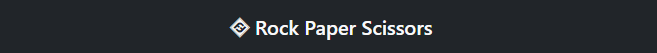

* Choice section

  Displays side by side the choice by AI and choice by player.

  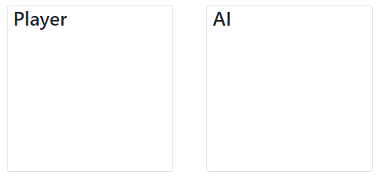

  

* Game Status

  Shows welcome message, points or final result on page and tab title.

  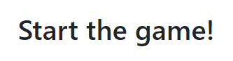

  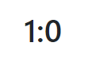

  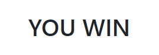

  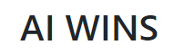

  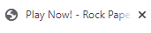

  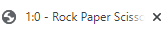

  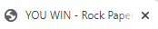

  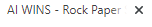

* Input Section

  Area to choose Rock Paper or Scissors.

  Buttons are highlightable.

  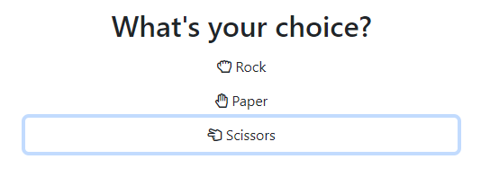


* Game Conclusion Section
  
  Area to display additional controls when the game ends.
  
  At the moment there is a restart button that reverses in color when highlighted.

  This button is a link to the homepage.

  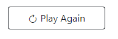

  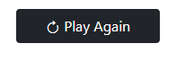

## Testing

### Validators

[W3C HTML](https://validator.w3.org/nu/?doc=https%3A%2F%2Fandodaryl.github.io%2Frock-paper-scissors-2%2Findex.html)

No HTML errors - click the link to run validator

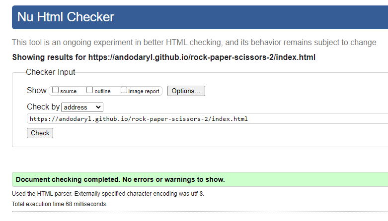

[W3C CSS](https://jigsaw.w3.org/css-validator/validator?uri=https%3A%2F%2Fandodaryl.github.io%2Frock-paper-scissors-2%2Findex.html&profile=css3svg&usermedium=all&warning=1&vextwarning=&lang=en)

No CSS errors - click the link to run validator.

There are numerous warnings, however these relate to BootStrap 5 code which are necessary.

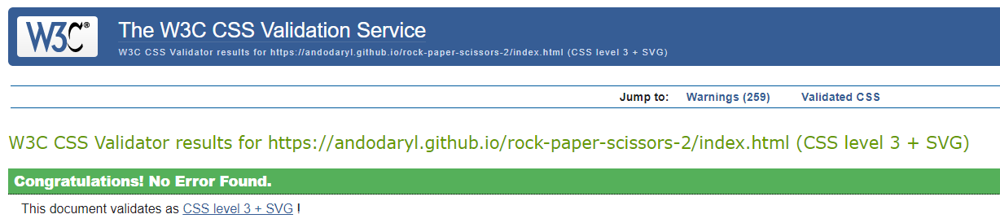

[JSHINT](https://jshint.com/)

No errors found.

There are warnings regarding ES6 however, these are necessary for ease of code.

There is also a warning pertaining to the use of private class variables - JSHINT cannot seem to recognise the syntax.

These warnings can be safely ignored for this use case, as target audience will likely use devices that support such features.

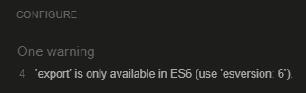

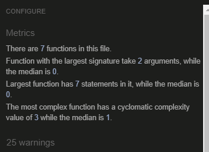

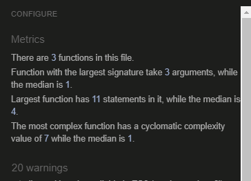

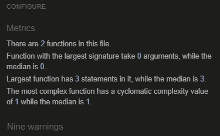

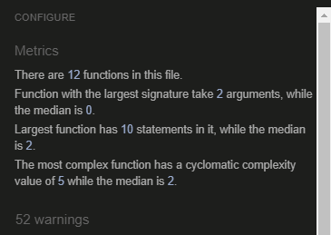

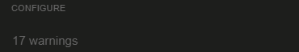

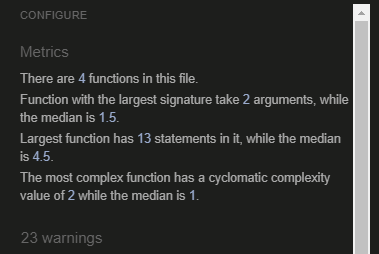

[Wave Accessibility](https://wave.webaim.org/report#/https://andodaryl.github.io/rock-paper-scissors-2/index.html)

No accessibility issues - click the link to run validator.

There is one warning however, regarding redundant links, which is due to logo link and restart button link both redirecting to home page.

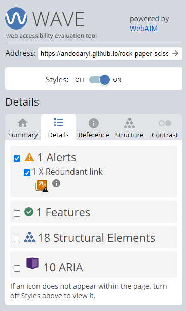

### Manual

Taken from user stories

* Be able to use the controls easily
  * Screen buttons and links are tab focusable which means the user can easily control the gaming using the TAB key to traverse down the menu, and SHIFT = TAB keys to traverse up the menu - highlighted buttons or links can then be activated using the SPACE or ENTER key.
  * Additionally, buttons are either highlighted when hovered, and or the mouse icon converts into a different pointer to indicate interactivity.
  * Game interaction is kept as simple as possible, witht he primary actions at the center of the screen for immediate access.
  * That simplicity avoids distraction and keeps the user focused with the primary use case of the web application.
* Replay the activity for endless use
  * When either player or AI reaches 3 points, the game is over and a button appears at the bottom of the screen leading to the homepage (the app page).
  * This way, the player can reload the page and start the game again.
  * Alternatively users can activate the logo to reload the app page.
* Keep track of my score
  * There are two containers which shows the player and AI choice.
  * Moreover, there is an area which provides a live update of both player and AI score.
  * There are additional prompts, such as the welcome message and the game over messages (i.e. Player Wins vs AI Wins) to depict the user's current progress.
* See feedback of my actions
  * Selecting an input updates the player choice input - which immediately prompts a response from the AI.
  * Selected choices are highlighted in blue to show that it has been activated.
  * Similarly, the restart button reverts in color when selected or hovered.
  * As previously described, the status section provides the player with their current game progress and player, along with AI choices are displayed live in the upper most containers.

## Deployment

With the help of this [tutorial](https://dev.to/yuribenjamin/how-to-deploy-react-app-in-github-pages-2a1f), the website was deployed to GitHub pages using the following steps:
1. After logging in, navigate to the target Github repo.
2. Select the “Settings” tab.
3. Select the “Pages” button on the menu to the left.
4. Select the "Main" branch as the source.
5. Select the "Save" button.
6. The website will be deployed automatically and a link to the live website will be displayed.

The live page is available [here](https://andodaryl.github.io/rock-paper-scissors-2/index.html).

## Forking Github Repos

According to [official Github documentation](https://docs.github.com/en/get-started/quickstart/fork-a-repo), this repo can be forked using the following steps:
1. After logging in, navigate to the target Github repo.
2. Select the "Fork" button located in top-right area of the page.
3. Select target location for the forked repo.

## Cloning Forked Repo via HTTPS

Additionally, you can download a local copy of the forked repo using the following steps:
1. After logging in to Github, navigate to the desired forked repo.
2. Select the "Code" button.
3. Copy the URL link below "Clone with HTTPS".
4. In a terminal with "GIT" installed, navigate to your target directory.
5. Using the `git clone` command, paste in the URL and press enter:
```
$ git clone https://github.com/YOUR-USERNAME/YOUR-REPO 
\> Cloning into `YOUR-REPO`...
\> remote: Counting objects: 10, done.
\> remote: Compressing objects: 100% (8/8), done.
\> remove: Total 10 (delta 1), reused 10 (delta 1)
\> Unpacking objects: 100% (10/10), done.
```

## Credits

Maintaining competence requires continuous learning from and reflection upon the work of others. It is important to give credit and acknowledgement not only to recognise time and effort expended but also to illustrate the rationale behind the methods applied and direct observers to the origins thereof.

Tutorials, resources used are as follows:

* [Use of Private Variables - Article](https://developer.mozilla.org/en-US/docs/Web/JavaScript/Reference/Classes/Private_class_fields)
* [Javascript Modules - Article](https://developer.mozilla.org/en-US/docs/Web/JavaScript/Guide/Modules)

### Technologies

Tools used in development:

Development Environment
* [GitPod](https://www.gitpod.io/)
* [Figma](https://www.figma.com/)

Testing
* [Chrome Devtools](https://developer.chrome.com/docs/devtools/)
* [W3C Validator](https://validator.w3.org/nu/)
* [CSS Validator](https://jigsaw.w3.org/css-validator/)
* [Accessibility Checker](https://wave.webaim.org/)

Content Generators / Sources
* [Code Institute Gitpod Template](https://github.com/Code-Institute-Org/gitpod-full-template)
* [Code Formatter](https://webformatter.com/)
* [MockUp Generator](http://techsini.com/multi-mockup/)

Frameworks / Libraries
* [Boostrap V](https://getbootstrap.com/)
* [Boostrap V Icons](https://blog.getbootstrap.com/2021/01/07/bootstrap-icons-1-3-0/)
* [Font Awesome 5](https://fontawesome.com/)

Languages
* [HTML5](https://www.w3schools.com/html/default.asp)
* [CSS](https://www.w3schools.com/css/default.asp)
* [Javascript](https://www.w3schools.com/js/default.asp)

### Further Acknowledgements
The vibrant [Slack](https://slack.com/) community, cohort, tutors and my mentor Akshat Garg at [Code Institute](https://codeinstitute.net/).

[Code Institute](https://codeinstitute.net/), [FreeCodeCamp](https://www.freecodecamp.org/), [TheOdinProject](https://www.theodinproject.com/), and [W3Schools](https://www.w3schools.com/) for providing me with fundamental skills for software development.
